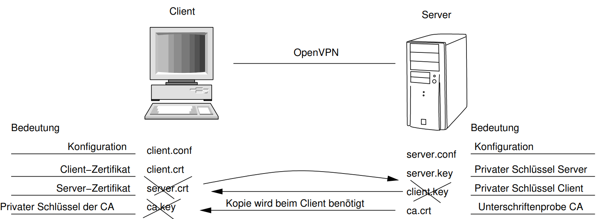

- # Definitionen
    - ### IT-Sicherheit
        - IT-Sicherheit beschäftigt sich mit der Vorbeugung, dem Erkennen und der Reaktion auf Ereignisse, die die Integrität der Daten, 
        - die Nutzbarkeit der Systeme und die (digitale) Privatsphäre gefährden.
    - ### Security vs Safety
    - Security: Angriffssicherheit
        - Schutz eines technischen Systems vor (Hacker-)Angriffen
    - Safety: Betriebssicherheit
        - Schutz vor einem System (technische Anlage, Flugzeugabsturz)
- ### Problematik
    - Gut und Böse sind nicht zu unterscheiden
- ### IT-Security
    - **Vorbeugung**
    - **Erkennung**
    - **Reaktion**
        - auf Ereignisse
    - **Integrität** der Daten || Spionage
    - **Nutzbarkeit** der Systeme || Sabotage
    - **Privatsphäre** gefährden ||
    - **Verfügbarkeit** || Missbrauch

- ## Definitionen
	- ### Hauptziele zum Schutz von Informationen
		- ### Vertraulichkeit/Zugriffsschutz
			- Nur berechtigte Personen sollen eine Nachricht lesen können
		- ### Integrität/Änderungsschutz
			- Ein Empfänger soll feststellen können, ob die Daten nach ihrer Erzeugung verändert wurden
		- ### Authentizität/Fälschungsschutz
			- Der Urheber einer Nachricht soll eindeutig identifizierbar sein
		- ### Verbindlichkeit/Nichtabstreitbarkeit
			- Der Urheber einer Nachricht soll nicht in der Lage sein, seine Urheberschaft zu bestreiten
- ## Begriffe
	- **Klartext** (cleartext): Ursprungsnachricht, die verschlüsselt werden soll
	- **Schlüssel** (key): Geheimnis, das zur Verschlüsselung eingesetzt wird
	- **Passwort** (password): Geheimnis, das zu einem Schlüssel führt. In einigen Anwendungen ist die Abbildung Passwort zu Schlüssel eine 1:1 Abbildung, sprich das Passwort entspricht dem Schlüssel
	- **Cipher** (cipher): Verschlüsselte Nachricht
- ## Verschlüsselungsverfahren
	- ### Stromchiffre Verfahren
		- Verschlüsselung findet zeichenweise statt
	- ### Blockchiffre Verfahren
		- Der Klartext wird in Blöcke eingeteilt
		- Es wird ein Block on Zeichen verschlüsselt (z.B. 256 Bit == 32 Zeichen)
		- unsicherer als Stromchiffre -> **Wiederholung**
	- ### Symmetrische Verfahren
		- Zum Ver- und Entschlüsseln wird der gleiche Schlüssel eingesetzt
	- ### Asymmetrische Verfahren
		- Zum Ver- und Entschlüsseln werden jeweils unterschiedliche Schlüssel eingesetzt
- ## Symmetrische Verfahren
	- ### Vorteil: Schnell
	- ### Nachteil: Shared Secret
		- ### Shared Secret Problemstellen
			- Wenn mehr als zwei Personen ein Geheimnis kennen kann eine "Verräter" nicht mehr eindeutig identifiziert werden: Das Geheimnis gilt als *nicht wirklich sicher*
			- **Schlüsseltransport:** Der Schlüssel muss zwischen den Partnern **sicher** ausgetauscht werden
	- ## Cäsar-Rotation
		- Stromchiffre-Verfahren
		- Rotiere die Buchstaben eines Satzes um ROT+n stellen im Alphabet
		- 
	- ## XOR-Verfahren
		- Zum Verschlüsseln wird ein Schlüssel eingesetzt
		- Die verschlüsselte Nachricht ergibt sich aus der XORVerknüpfung des Klartextes mit dem Schlüssel
		- ### Vorteil
			- Sehr sicheres Verfahren unter den Voraussetzungen:
				- Der Schlüssel ist mindestens so lang wie die Nachricht
				- Die Zeichen des Schlüssels sind gleichverteilt
				- Alle Zeichen des Alphabets tauchen gleichhäufig im Schlüssel auf
		- ##
	- ## Schlüsselwahl
		- Folge von Pseudozufallszahlen. Das Passwort ist der Initialwert für den Zufallszahlengenerator.
		- Schlechtere Variante: Übergang zu Blockchiffre, bei der der Block so lang wie der Schlüssel ist.
-
	- ## Electronic Code Book (ECB)
		- 
		- Plaintext wird direkt mit dem Key verschlüsselt um den Ciphertext zu generieren
		- 
		- Decryption kann mit dem selben Key vorgenommen werden
		- ### Unsicher
	- ## Cipher Block Chaining (CBC)
		- ### Verschlüsselung
		- Block wird mit Key **und** Ciphertext des vorhergehenden Blocks verknüpft
		- Erster Block nutzt **Initialisierungsverktor IV**
		- 
		- SICHER, aber nicht parallelisierbar (auf Multicoresystemen)
		- ### Entschlüsselung
		- XOR-Vernküpfung von
			- Cipher
			- Cipher um einen Block nach rechts verrückt
				- Erster Block mit dem IV
			- Schlüssel
		- führt zum Klartext
		- 
	- ## Counter Mode (CTR)
	- Jeder Block wird mit Key + IV vernküpft
	- Jeder Block hat individuellen IV
	- IV ergibt sich bspw. aus XOR eines Zufallswertes mit Blocknummer
	- **Es ist parallelisierbar**
	- ### Encryption
	- 
	- ### Decryption
	- 
	-

- ## Kennzeichen
	- Nachrichten/Daten werden für einen definierten Personenkreis verschlüsselt.
	- No shared secret
	- Private + zugehöriger public Key
	- Ermöglicht Digitale Signatur
	- Aufwändig/Laufzeitintensiv
- ## Schlüsselpaar
	- ### Private Key
		- Entschlüsseln von Nachrichten (Daten)
		- Digitale Signatur
		- Muss geschützt werden
			- Symmetrische verschlüsselung?
	- ### Public Key
		- Verschlüsseln von Nachrichten (Daten)
		- Verifikation von Signaturen
		- Verifikation der Integrität einer Nachricht (Daten)
		- Darf und **SOLL** veröffentlicht werden
	- ### Problem
		- Zuordnung zwischen realer Person und öffentlichem Schlüssel
- ## Verfahren
	- Teilnehmer benötigen Schlüsselpaar
	- Teilnehmer benötigen public Key des Empfängers bzw. des Autors der digitalen Signatur
	- Schlüsselpaar wird initial einmal generiert
	- Private Key muss behütet werden -> Darf nicht geleakt werden
	- Public Key kann öffentlich verteilt werden
- 
	- ### Beispiel Verschlüsseln:
		- Datei `myfile` für Empfänger `blake@cyb.org`
		- Verschlüsselte Datei ist `myfile.gpg`
		- Datei kann nur von Private Key Besitzer entschlüsselt werden
		- Mehrere Empfänger möglich
		- `gpg` sucht mit Email in *Schlüsselring* nach zugehörigem **public key**
		-
		  ```shell
		  gpg --output myfile.gpg --encrypt myfile -r blake@cyb.org
		  ```
	- ### Entschlüsseln
		- Blake entschlüsselt `myfile.gpg`
		- Klartext wird in `myfile` abgelegt
		- Private Key der zu `blake@cyb.org` gehört wird benötigt
		- `gpg` sucht mit Email nach zugehörigem **private key**
		-
		  ```shell
		  gpg --output myfile --decrypt myfile.gpg
		  ```
- ## Erstellung von Schlüsselpaaren
	- ### openssl
		-
		  ```shell
		  // creates private key
		  openssl genrsa -out private.pem 2048
		  
		  // creates public key from private key
		  openssl rsa -pubout -in private.pem -out public.pem 
		  
		  // shows contents of key
		  openssl rsa -text -in private.pem
		  ```
	- ### gpg
		-
		  ```shell
		  gpg --gen-key
		  ```
- ## Digitale Unterschrift
	- *Klartext* wird mit **private Key** digital signiert
	- Signatur enthält Hashwert des Klartexts -> Ermöglicht Überprüfung des Originals
	- Signatur kann an Klartext angehängt -> Klartext + Signatur möglich
	- Oder Signatur als eigene Datei (abgetrennte Signatur)
	- ### Beispiel:
		- Versehe `myfile` mit abgetrennter Signatur in `myfile.sig`
		-
		  ```shell
		  gpg -a --sign --output myfile.sig --detach-sig myfile
		  ```
	- ### Überprüfung
		- Benötigt: abgetrennte Signatur + signierte Datei
			- Public Key des Signierenden benötigt
		- Mit *public key* des Signierenden und digitaler Unterschrift
			- -> überprüfen ob Datei `myfile` von Besitzer des public key stammt
			- -> überprüfen ob `myfile` nachträglich modifiziert wurde
		-
		  ```shell
		  gpg --verify myfile.sig myfile
		  ```
	- ## Fragen:
		- Alice möchte Bob und Carl verschlüsselte Mails schicken. Welche Schlüssel benötigt Alice, welche Bob und welche Carl?
			- **Alice**: Public Key von Bob und Carl (zum Verschlüsseln)
			- **Bob**: eigenen private key (zum Entschlüsseln)
			- **Carl**: eigenen private key
		- Alice möchte Bob und Carl *signierte, unverschlüsselte* Mails schicken. Welche Schlüssel benötigt Alice, welche Bob und Carl?
		- **Alice**: eigenen, private key (digital signature)
		- **Bob**: public key von Alice
		- **Carl**: public key von Alice
	- ## Zertifikate
		- Kombination aus
			- Public key
			- Identifikationsmerkmale (Meta-Informationen)
			- Digitale Unterschrift
		- wird **Zertifikat** genannt
- ## Echtheitsnachweis
	- ### Certificate Authority (CA)
		- Institution, die Zertifikate (vertrauenswürdig) signiert
	- ### Public Key Infrastructure (PKI)
		- Technische Umgebung zur **Erstellung, Signatur, Verteilung** und **Rückruf** von Zertifikaten
		- ### Vorgehen
			- Public-Key erstellen
			  logseq.order-list-type:: number
			- **Signing-Request** erstellen
			  logseq.order-list-type:: number
			- Public-Key + Metainformationen + Signing-Request an die CA übergeben
			  logseq.order-list-type:: number
			- CA prüft Echtheit
			  logseq.order-list-type:: number
			- CA signiert Zertifikat (als Issuer)
			  logseq.order-list-type:: number
			- CA verteilt Zertifikat
			  logseq.order-list-type:: number
		- (Weiteres:) Zertifikat zurückrufen (revoke)
	- ### Hierarchische PKI
		- Zentrale (vertrauenswürdige) Instanz signiert den public key
			- Certificate Authority
		- Bsp.: Verisign, Lets Encrypt
		- Email-Verschlüsselung über S/Mime
	- ### Web of Trust
		- Dezentrales Verfahren
		- Zertifikate bekommen mehrere Signaturen
			- Key-Signing-Parties
			- Jeder kann ein Zertifikat unterschreiben
			- Vertrauen kann über *Vertrauensketten* gestärkt werden
		- Echtheit wird über Vertrauensstufen realisiert
			- Hohe Vertrauensstufe bei vielen (vertrauenswürdigen Signaturen)
		- #### Beispiel Vertrauenskette
			- *Alice* signiert den Schlüssel von *Bob*
			- *Bob* signiert den Schlüssel von *Carl*
			- *Alice* vertraut damit auch *Carl*
	- ### Öffentliche PKI
		- Zentrale, öffentliche PKIs sind anfällig
		- Kann **keine** Sicherheit garantieren, da *Fremden* vertrauen geschenkt werden muss
		- HTTPS garantiert über öffentliche Zertifikate verschlüsselte Verbindungen -> ABER keine vertrauenswürdige Authentifizierung
	- ### Private CA's
		- CA's die intern (Unternehmen, privat) eingesetzt werden sind *sicher* -> Keinen Fremden muss getraut werden
			- Beispiel: OpenVPN-Zertifikate der HSNR
	- ## Certificate Revokation
		- Zertifikate haben Gültigkeit (von, bis)
		- Ist der private key zu einem Zertifikat verloren muss das Zertifikat zurückgerufen werden (revoked)
		- public key -> als ungültig markiert
		- Rückruf in *öffentliche* Rückrufliste (Revocationlist) eingetragen
		- Prüfende Instanz muss Revocationlist abfragen (Online-Verbindung notwendig)
		- *Revocation Certificate* als Legimitation für Rückruf -> Agiert ähnlich zu einem private key (??)
		- ### Prüfungsfrage: Unter welchen Umständen ist eine ÖFFENTLICHE PKI sicher?
			- Wenn der private key der CA SICHER aufbewahrt wird
			  logseq.order-list-type:: number
			- Wenn sichergestellt, dass public key wirklich von der CA stammt
			  logseq.order-list-type:: number
			- Wenn Mitarbeiter der CA Organisation vertrauenswürdig sind
			  logseq.order-list-type:: number
		- => Also **NIE**
		- ### Prüfungsfrage: Unter welchen Umständen ist eine PKI sicher?
			- Wenn sie selbst betrieben wird
			- Wenn der private Key der CA **sicher** aufbewahrt wird
			- Wenn Mitarbeiter vertrauenswürdig sind
- ## Datenverschlüsselung
	- Das Datenschutzgesetz verpflichtet uns in vielen Fällen sensible Informationen vor unberechtigtem Zugriff zu schützen
	- => Datenverschlüsselung
	- ### Varianten
		- Verschlüsselung von einzelnen Dateien
		  logseq.order-list-type:: number
		- Komplettverschlüsselung eines Datenträgers (Blockgerät)
		  logseq.order-list-type:: number
		- Partielle Verschlüsselung: Schützenswerte Dateien werden verschlüsselt und in *harmlosen* Dateien versteckt
		  logseq.order-list-type:: number
			- => enthält real ein komplettes, verschlüsseltes Filesystem
			  logseq.order-list-type:: number
	- ### Software
		- PGP zur Verschlüsselung von einzelnen Dateien oder auch E-Mails
		- VeraCrypt zur Verschlüsselung von Datenträgern
		-
- ## VeraCrypt
  -  Open-Source pontenzial sicherer sein kann
  - SW kann auf versteckte Funktionalitäten hin überprüft werden
  - Plattformunabhängigkeit
  - Mobile Lösung durch Verwendung von Flash-Medien
  - Nutzbar als Konsolenwerkzeug, aber auch über eine grafische Oberfläche
  - ### Hidden Volume
    -  Äußerer Container (sichtbar) enthält Scheindaten und einen
    - inneren Container, der versteckt und nicht erkennbar oder nachweisbar ist.
    - Für den Zugang gibt es zwei Passwörter: 
      - eines für den äußeren Container
      - eines für den inneren Container
    - 1. Äußeres Volume mit eindeutigem Passwort anlegen.
    - 2. Äußeres Volume mounten und Alibi-Daten in das äußere Volume schreiben.
    - 3. Volume wieder aushängen.
    - 4. Inneres Volume mit eigenem, starkten Passwort anlegen. 
      
- ## EMail-Verschlüsselung
  - Grundsätzlich konkurieren zwei Verfahren:
  	- => S/Mine
    - =>  PGP
  - Unterschied:
    - S/Mime setzt auf eine zentrale PKI
    - PGP nutzt den Web of Trust Ansatz
  - Software: Integration in vielen Produkten, insbesondere **Thunderbird**.

- ## Hashing
  - Gewährleistung von Integrität von Daten.
  - Verschlüsselung des Passwortes.
  - Hahwerte plus Signatur dienen als Integritätsschutz für
  - Sotware (zum Beispiel beim automatischen Update).
  - ## Verifikation von Software-Paket
    - Download der Software
	- Download des signierten Hashwertes

- ## Kapitel Zugriffskontrolle
  - ### Credentials 
    - /etc/passwd: Logindaten (Name, Homeverzeichnis, Loinshell)
    -	/etc/shadow: Secrets (Salz, Passworthash, Algorithmus, ... )
    -	/etc/group: Gruppen und deren Mitglieder
  - ### Loginprozess
    - Rechenprozess erfragt den Loginname 
    - Soald der Name eingegeben worden ist, mutiert (Stichwort exec) der Job zum Login-Prozess. 
    - Login-Prozess erfragt das Passwort 
    - Login-Prozess hasht Passwort+Salz und mutiert bei Übereinstimmung die in /etc/passwd abgelegte Loginshell.
  - ### Sicherheitskonzepte
    - ** Klassisch: Discretionary Access Control:** Die Zugriffsentscheidung basiert auf der Identität des
	  Users/Rechenprozess. Die Zugriffsrechte werden für Objekte
	  (Dateien) pro Benutzer festgelegt.  
      - Jedes Objekt (Datei) hat einen
	  	- Besitzer (owner, user) und ist einer
	  	- Gruppe (group) zugeordnet. Dazu gibt es noch die 
        - Übrigen (other)
	  Jobs laufen unter der Kennung des Aufrufers und können
	  entsprechend der Besitzer-Rechte auf Objekte zugreifen.
	  Der Super-User (Root) darf auf alle Objekte zugreifen 
    - **Mandatory Access Control:** Die Zugriffsentscheidung basiert auf allgemeinen Regeln und
	  zusätzlicher Information über den Zugreifenden
	  (User/Rechenprozess).
    - **Role Based Access Control:** Rechte werden auf Basis von Arbeitsprozessen abstrahiert.
	  Benutzern werden eine oder mehrere Rollen (z.B. Webmaster)
	  zugeordnet. Die Zugriffsentscheidung auf Betriebsmittel
	  (Objekte, Dateien) findet auf Basis der aktuellen Rolle des
	  Zugreifenden (Rechenprozess) statt. Je nach Rolle sind dabei
	  möglicherweise unterschiedliche Zugriffsberechtigungen
	  notwendig.
  - ### Rechte 
    - Für jedes Objekt sind die folgenden Rechte festzulegen:
      - Lesen
      - Schreiben
      - Ausführen/Wechseln
    - Zusätzlich gibt es noch die Attribute S-Bit und Sticky-Bit
      - S-Bit: Ein Programm wird unter der ID des Besitzers gestartet, und bekommt nicht – wie sonst üblich – die ID des Elternprozess vererbt
      - Sticky-Bit: Löschen oder Umbenennen von Dateien ist nur
      dem Besitzer erlaubt.
    -  Bei gesetztem S-Bit kann ein Programm zwischen den ID’s
      (Besitzer/Aufrufer) umschalten
    - Spezialrechte ergeben sich aus der Kombination von S-Bit
	  user, S-Bit group und Sticky-Bit (sst)
- ### Firewall
	Firewall herungssystem zum Schutz vor unerwünschten (Netzwerk-)zugriffen.
  - ### Realisierungsform
    - Aktive Komponente, die Datenpakete entgegennimmt und filtert.
    	- Komponente zwischen zwei Netzen
     	- Komponente zwischen Netz und Endpunkt (z.B. Rechner, Applikation)
    - Eine spezielle Form eines Routers.
  - ###  Aufgabe
    - Filterung des Datenverkehrs (z.B. verdächtige Pakete
      wegwerfen)
    - Abicherung von Diensten (die beispielsweise unbewusst/ungewollt aktiv sind. 
    - Reduktion der Wahrscheinlichkeit, das Software-Fehler augenutzt werden können
      - Daten durchlaufen weniger Code, da diese erst gar nicht die
        Applikation erreichen.
        - Je weniger Code durchlaufen wird, desto weniger
        (Software-)Fehler können getriggert werden.
    - Last-Reduktion
  - ### Portadressen
    - tp 21/tcp telnet 23/tcp
	-  ssh 22/tcp ssh 22/udp
	-  http 80/tcp http 80/udp
	-  https 443/tcp https 443/udp
	-  smtp 25/tcp smtp 25/udp
	-  dns 53/tcp dns 53/udp
	-  openvpn 1194/tcp openvpn 1194/udp
- ### VPN
  - Technik zur sicheren Verbindung mehrerer (meist privater) Teilnetze 
  - Ermöglicht den geschützten, ortsunabhängigen Zugriff auf interne Daten. 
  - Verwendet meist einen öffentlichen Carrier (Internet).
  - ### Vorteile
    - Subnetze unterschiedlicher (Unternehmens-)Standorte erscheinen wie ein Netz. 
    - Preiswerte Technologie 
    - Sichere Datenübertragung
  - ### Aufbau 
  	- 1. Tunneln
    - 1. Authentifizieren
	- 1. Verschlüsseln
  - ### Einsatz
    - Site-to-Site
      - Mehrere Standorte werden preiswert und sicher miteinander
		verbunden. 
      - Alternative zu einer (teuren und unsicheren) Standleitung. 
      - Ermöglicht auch Partnerfirmen den kontrollierten Zugriff auf Teile des internen Netzes
    - Site-to-End
      - Remote-Zugriff auf das Intranet (z.B. Hochschule
		Niederrhein)
      - Anbindung von Heimarbeitsplätzen an das
		Unternehmensnetz.
    - End-to-End
      - Zwei (oder auch mehr) Nutzer tauschen sicher Daten
		miteinander aus.
  - ### IPSec
    - Im professionellen Umfeld verbreitet 
    - Einsatzszenario Site-to-Site (seltener Site-to-End)
    - Sehr komplex!!!
      - => Unproblematischer: Peering-Points vom gleichen Hersteller
    -  Nur eingeschränkt Client-Software verfügbar
  - ### WireGuard
    - Performante VPN-Implementierung 
    - Open Source 
    - Einfach strukturiert:
      - Nur UDP 
      - Limitiertes Set an Verfahren für Schlüsselaustausch und 
        - **Verschlüsselung**
          - Curve25519 
          - ChaCha20
    - Integration im Linux-Kernel (ab 5.6 im Standard-Kernel)
    - Implementierungen für Linux, BSD-Varianten, Windows, Mac)
  - ### Vorteile 
    - Portabilität - benötigt nur sehr geringe Kernelunterstützung 
    - Verbreitung - durch viele Betriebssysteme unterstützt
  - ### Nachteile 
    - Laufzeit - Zeitverzögerung durch notwendige Kontextwechsel Kernel-Userland 
    - Angriffsfläche für DoS-Angriff
  - ### Technik
    - Pakete, die an eine zum Tunnel-Endpunkt gehörende
		 IP-Adresse geschickt werden, werden nicht an ein
		 physisches Netzwerkinterface geroutet, sondern an die
		 OpenVPN-Applikation weitergereicht. 
    - OpenVPN-Applikation verpackt die Daten in udp (oder tcp)
		 Pakete und schickt sie normal (und mit Hilfe von TSL) an
		 die Gegenstelle. 
    - Die Gegenstelle packt die Daten aus und routet sie ins
		 interne Netz. 
    - Für das Routen der Pakete an die OpenVPN-Applikation
		 wird ein (logisches) Netzwerkinterface benötigt
		 (TUN-Device). 
  - ### Ablauf
    - 1. Die Applikation fordert Daten an (zum Beispiel
		 http://rechner.in-meinem-netz.de, IP=192.168.99.19). 
    - 1. Der Kernel routet die Anfrage (Daten) an das TUN-Device
		 weiter. 
    - 1. Das TUN-Device übergibt die Daten dem lokalen
		 OpenVPN-Prozess. 
    - 1. Der lokale VPN-Prozess verschlüsselt die Daten und
		 übergibt diese dem Kernel mit dem Auftrag, sie an den
		 Zielserver zu verschicken (über UDP-Port 1194,
		 Öffentliche-Ziel-IP=194.94.121.156). 
    - 1. Die Daten werden übertragen.
    - 1. Der Kernel auf dem Zielrechner packt die Daten aus und
	   übergibt sie der Applikation, die auf dem UDP- Port 1194
	   lauscht. 
    - 1. Der OpenVPN-Server entschlüsselt und authentifiziert die
     Daten und übergibt sie zurück an den Kernel, der sie an die
     in den Daten spezifizierte IP-Adresse (IP=192.168.99.19)
     routet.
  - ### Requirements
    - 1. PKI
    	- CA-Zertifikat (Public-Key)
        - CA privater Schlüssel (zum Unterschreiben der Zertifikate)
    - 1. Server
    	- Server-Zertifikat (mit Unterschrift der CA)
        - Server privater Schlüssel 
        - CA-Zertifikat (zur Unterschriftenprobe)
    - 1. Clients 
    	- Client-Zertifikat (mit Unterschrift der CA)
        - Client privater Schlüssel 
        - CA-Zertifikat (zur Unterschriftenprobe)
    
  - ### OpenVPN Server (unter Linux) konfigurieren
    - Eigene PKI aufsetzen (separater Rechner)
    	- CA-Schlüsselpaar erstellen
    	- CA-Zertifikat erstellen
	-  Schlüsselpaare erzeugen (Server, Clients, auf den Rechnern
	  selbst)
        - Antrag auf Unterschrift erstellen (signing requests)
	-  Zertifikate unterschreiben
      - Server Zertifikat unterschreiben
      - Client Zertifikate unterschreiben
    -  Installation Server/Client
      - Konfigurationen erstellen
  - ### OpenServer aufsetzen Code
	```Shell
 	# 1. Software Instalation
	apt-get install openvpn easy-rsa
	mkdir -p /etc/openvpn/<name>`
	cd /etc/openvpn/<name>/
 
 	# 2. Initialisieren PKI
	cp -r /usr/share/easy-rsa/ .
	cd easy-rsa
	cp vars.sample vars
 
	vim vars // Variablen setzen
	./easyrsa init-pki
 
	# 3. CA aufbauen
 	/asyrsa build-ca
 	.easyrsa gen-dh
 	
 	# 4. Server-Schlüsselpaar Signatur-Anfrage erstellen
 	/easyrsa gen-req server server-name nopass
 
 	# 5. Client-Schlüsselpaar Signatur-Anfrage erstellen
 	./easyrsa gen-req client client-name
 
 	# 6. Schlüssel unterschreiben
	./easyrsa sign-req server-name
	./easyrsa sign-req client-name
	```
- ## Passwörter
  - ### Lan-Manager Hash
    - #### Genauere Analyse
      - 14 Passwortzeichen (gut)
      - nur Großbuchstaben (schlecht)
      - werden eingeteilt in zwei Gruppen zu je 7 Zeichen (Katastrophe)
      - jede Gruppe wird unabhängig gehasht (???????????)